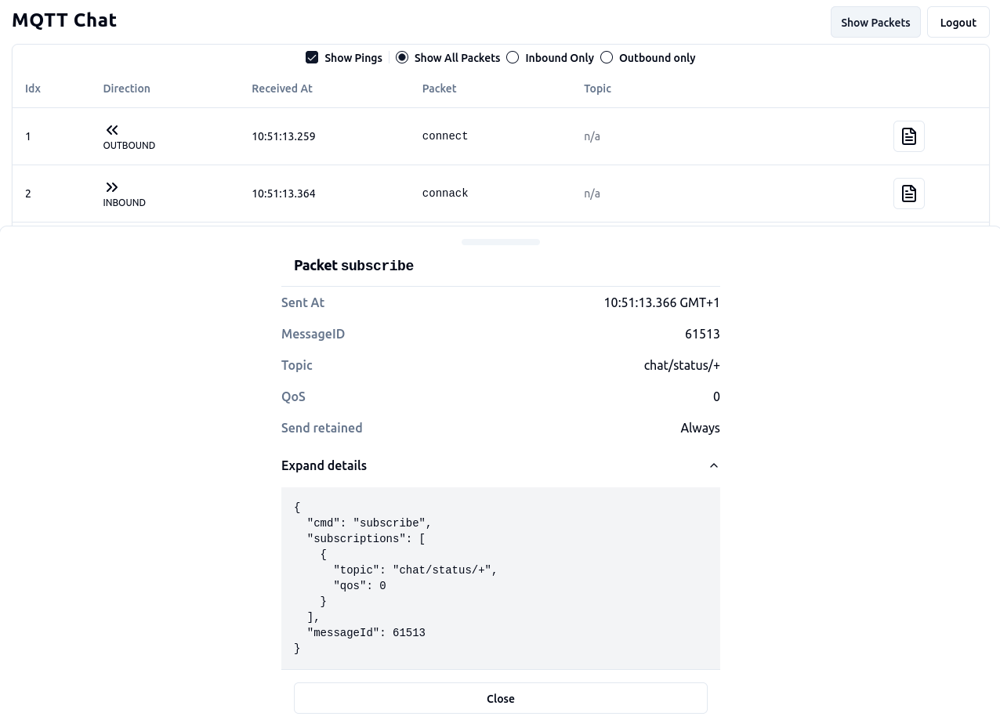

# MQTT For Webdevs: Example Chat App

This repository contains a simple chat applications that uses MQTT to exchange the messages between clients.
It is used as a demonstration of the capabilities of the protocol and how they could be used in web applications.

This projects accompanies my talk and [blog post](http://sebastian-staffa.eu/posts/mqtt-for-webdevs) of the same name.

Uses [Vite](https://vitejs.dev/), [Vitest](https://vitest.dev/), and [React Testing Library](https://github.com/testing-library/react-testing-library) to create a modern [React](https://react.dev/) app compatible with [Create React App](https://create-react-app.dev/)

## Setup

This project requires

- node v22
- docker

You can use the accompanying `shell.nix` file or nvm to select the correct node version.
Other node versions may work but are untested.

To get started, run

```
npm install
```

to install the dependencies and either run

```
docker compose up -d
```
or 
```
nix-build brokers.nix
./result/bin/mosquittos
```
to spin up the MQTT broker(s).

```
npm run dev
```

start the development server. The application should be served at `http://localhost:5173/`.

## Configuration

The application offers a few settings that configure the features that are available. These
settings corrospond to the chapters in my blogpost


- `Use QoS 1` enables QoS 1 for the chat messages.
- `Use Status Messages` enables chat status messages which are sent whenever client comes online
  or goes offline. These message use the retain and lwt features.
- `Use Authentication` decides which broker to use. The docker
  compose file contains two brokers, one with and one without authentication.
- `Deduplicate messages client side` enables the deduplication of incoming chat messages using
  the embedded message id. This filters additional deliveries of the same message when using QoS 0/1.

## Usage

The easiest way to use the application is to open it in two browser windows and chat with yourself.
Without the `Use Authentication` checkbox set, you can just enter any name and start chatting. To create a new chat,
click the `Add Chat` button on the left after login and enter the name of your chat partner (the name you chose in the
second browser tab).

By clicking on the `Show Packets` view in the top right you can toggle between the chat view and the MQTT packet view.
This view lists all packets in the order that they were sent and received. You can filter by incoming and outgoing packets
as well as hide ping messages. A click on the document button on each entry will show the details of the selected packet.



If you enable the `Use authentication` checkbox, you need to enter the credentials of a user that has been
previously registered with the broker. The following usernames are available without changing the configuration:

- sebastian
- peter
- hannes
- vy
- minh
- jenny
  Each user has the password `test`. There is also an additional admin user which can read all messages with
  the username `admin` and password `test`.

### About the template

This project was set up using the vite template for redux with the following command:

```sh
npx degit reduxjs/redux-templates/packages/vite-template-redux my-app
```

further reading: [Redux Toolkit](https://redux-toolkit.js.org/)
